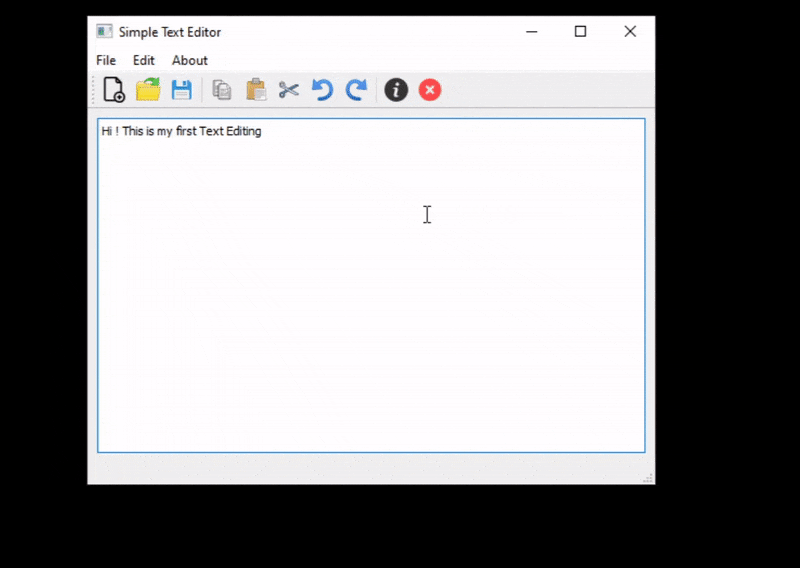

# notepadAppTry
My first ever app with a GUI using Qt Creator, a famous C++ framework.

In this repository i will try to implement my very first app in Qt Creator using it's framework and, of course, C++;

Firstly, i will implement some basic toolbar alongside the menu - the main focus of all this is to improve my classes handling skill and to help me get familiar with Qt framework;

You can see the main implemented functionalities in the following GIF:

